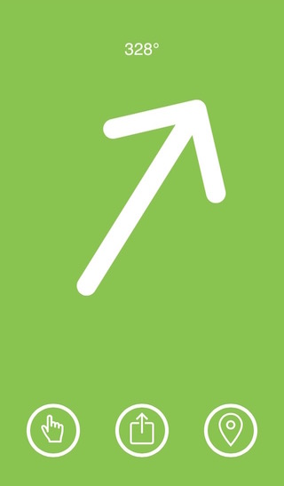
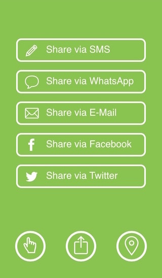
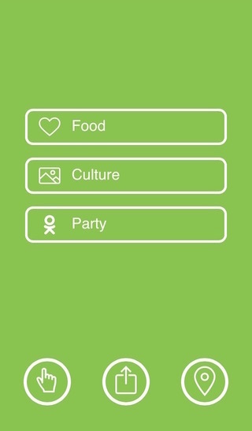

[](https://travis-ci.org/sbstnmsch/nip.to-app)

# nip.to<sup>&reg;</sup> client
nip.to is a free service to share your current location to
friends, - even if they don't use nip.to.

## How does it work
Use nip.to to get your current location and share a special link
via eMail, SMS, WhatsApp, iMessage or whatever.

Once your friends open that link they are routed via a simple
compass app to finally *nip to you*.

Great for hanging out in the park, festivals, finding the way out
of the desert and even lost cars.

## How to use it
Hit http://nip.to with your smartphone or tablet and you are all
in.

## Looks like damn simple
<div>
  
  
  
</div>

## Contributing
To start a local client copy `src/config/nipto-default.json` to
`nipto.json`, fill out... and do:
```
$ npm install
$ grunt
$ nginxere # available at https://github.com/sbstnmsch/nginxere
           # or just serve ./dist with your favorite webserver
```
